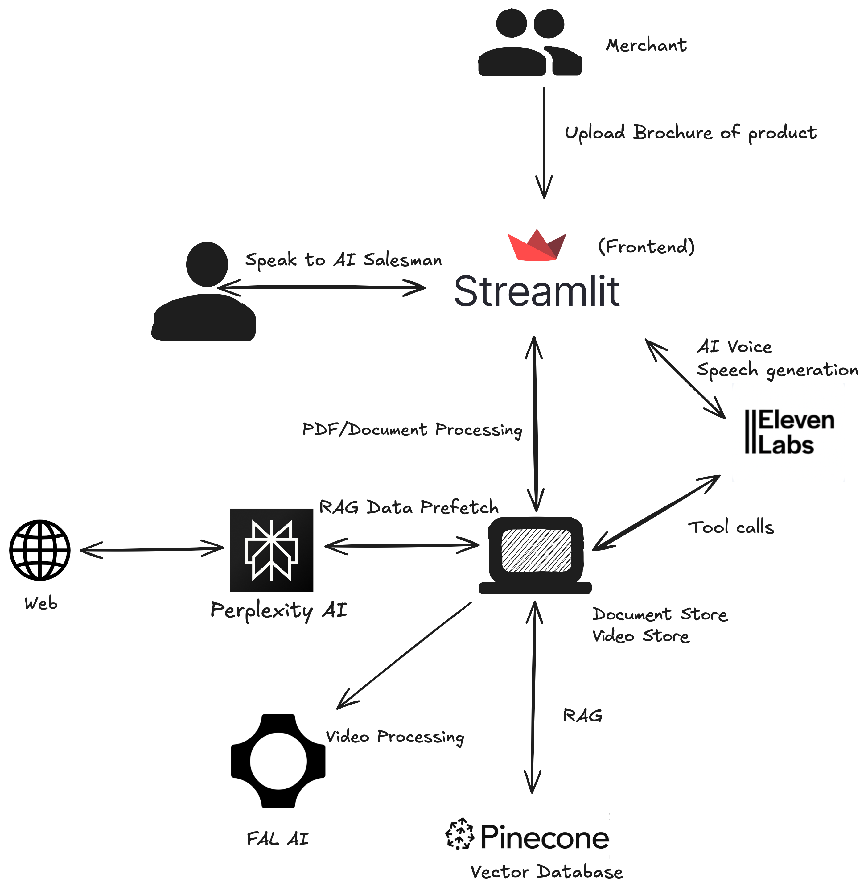

# AI Car Sales Agent - Data Ingestion System

A sophisticated data ingestion system that processes car brochures and scrapes web data to create a comprehensive knowledge base for an AI car sales agent.

# Demo
- https://www.youtube.com/watch?v=iIw3f0mUAlQ

## System Architecture



The system architecture shows the flow of data and interactions between different components:
- Merchants can upload product brochures
- Users interact with an AI Salesman through the Streamlit frontend
- The backend processes documents and videos using Perplexity AI and FAL AI
- Eleven Labs provides AI voice generation
- Data is stored in Pinecone vector database
- RAG (Retrieval Augmented Generation) is used for enhanced responses

## Features

- Markdown brochure processing
- Automated web scraping from multiple automotive sources
- Data deduplication and merging
- Structured data output in JSON format
- Async web scraping with rate limiting and retry logic
- Comprehensive error handling and logging

## Prerequisites

- Python 3.9 or higher
- pip (Python package installer)

## Installation

1. Clone the repository:
```bash
git clone <repository-url>
cd ai-car-sales-agent
```

2. Create a virtual environment:
```bash
python -m venv venv
source venv/bin/activate  # On Windows: venv\Scripts\activate
```

3. Install dependencies:
```bash
pip install -r requirements.txt
```

4. Create a `.env` file in the project root with the following content:
```env
OPENAI_API_KEY=your_openai_api_key
PINECONE_API_KEY=your_pinecone_api_key
PINECONE_ENVIRONMENT=your_pinecone_environment
```

## Project Structure

```
.
├── src/
│   ├── data_ingestion/
│   │   ├── __init__.py
│   │   ├── brochure_processor.py
│   │   ├── web_scraper.py
│   │   └── data_ingestion_orchestrator.py
│   ├── config/
│   │   ├── __init__.py
│   │   └── config.py
│   └── utils/
├── brochures/
│   └── toyota_camry_2024.md
├── data/
├── tests/
├── requirements.txt
└── README.md
```

## Usage

1. Place your car brochure in markdown format in the `brochures/` directory.

2. Run the data ingestion system:
```python
from src.data_ingestion.data_ingestion_orchestrator import DataIngestionOrchestrator
import asyncio

async def main():
    orchestrator = DataIngestionOrchestrator()
    car_model = "Toyota Camry 2024"
    brochure_path = "brochures/toyota_camry_2024.md"
    
    combined_data = await orchestrator.process_car_data(brochure_path, car_model)
    print(f"Successfully processed data for {car_model}")

if __name__ == "__main__":
    asyncio.run(main())
```

## Output Format

The system generates JSON files in the `data/` directory with the following structure:

```json
{
  "specifications": [...],
  "features": [...],
  "pricing": [...],
  "performance": [...],
  "safety_ratings": [...]
}
```

## Contributing

1. Fork the repository
2. Create a feature branch
3. Commit your changes
4. Push to the branch
5. Create a Pull Request

## License

This project is licensed under the MIT License - see the LICENSE file for details.

## Acknowledgments

- Built with Python and modern async libraries
- Uses BeautifulSoup4 for web scraping
- Implements best practices for rate limiting and error handling 
